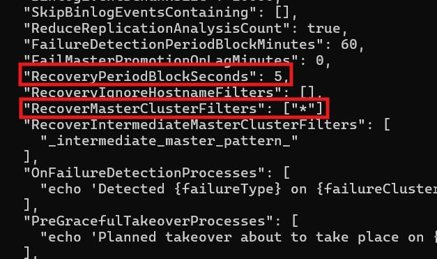
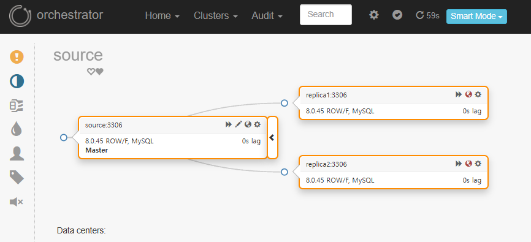
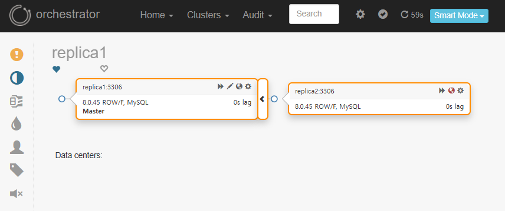

#  MySQL HA 실습 - Orchestrator 기반 Auto Failover

Docker 환경에서 MySQL 8.0 Replication 구조를 구성하고  
Orchestrator를 이용해 **Master 장애 발생 시 Replica 자동 승격(Auto Failover)** 이 동작하는지 검증한 실습 프로젝트입니다.

<br/>


## 📌 실습 개요

### 목표
- MySQL Replication 구조 이해
- GTID 기반 복제 구성
- Orchestrator를 이용한 장애 감지 및 자동 승격
- Master 장애 발생 시 Replica가 자동으로 Master로 승격되는지 검증

<br/>

### 구성 요소

| 역할 | 설명 |
|------|------|
| Orchestrator | Replication Topology 관리 및 Auto Failover |
| source | Primary (Master) |
| replica1 | Secondary |
| replica2 | Secondary |

<br/>

## Tech Stack

- MySQL 8.0
- GTID Replication
- Orchestrator
- Docker / Docker Compose


<br/>

## 🚀 실행 방법
### 1. 컨테이너 실행

```bash
docker compose up -d
```

### 2. 컨테이너 상태 확인

```bash
docker compose ps
```

<br/>


## Replication 설정

### 1. Replica 읽기 전용 설정

```bash
docker exec -it replica1 mysql -uroot -proot -e "SET GLOBAL read_only=ON; SET GLOBAL super_read_only=ON;"
docker exec -it replica2 mysql -uroot -proot -e "SET GLOBAL read_only=ON; SET GLOBAL super_read_only=ON;"
```

<br/>

### 2. source에 복제 계정 생성

```bash
docker exec -it source mysql -uroot -proot -e "
CREATE USER 'repl'@'%' IDENTIFIED BY 'repl';
GRANT REPLICATION SLAVE ON *.* TO 'repl'@'%';
FLUSH PRIVILEGES;"
```

<br/>

### 3. Replica 연결
```bash
docker exec -it replica1 mysql -uroot -proot -e "
CHANGE REPLICATION SOURCE TO
  SOURCE_HOST='source',
  SOURCE_USER='repl',
  SOURCE_PASSWORD='repl',
  SOURCE_AUTO_POSITION=1;
START REPLICA;"

docker exec -it replica2 mysql -uroot -proot -e "
CHANGE REPLICATION SOURCE TO
  SOURCE_HOST='source',
  SOURCE_USER='repl',
  SOURCE_PASSWORD='repl',
  SOURCE_AUTO_POSITION=1;
START REPLICA;"
```

<br/>

## Orchestrator 설정

### 1. Orchestrator가 MySQL에 접근할 계정 생성

```bash
docker exec -it source mysql -uroot -proot -e "
CREATE USER 'orc_client_user'@'%' IDENTIFIED BY 'orc_client_password';
GRANT SUPER, PROCESS, REPLICATION SLAVE, RELOAD ON *.* TO 'orc_client_user'@'%';
GRANT SELECT ON mysql.slave_master_info TO 'orc_client_user'@'%';
FLUSH PRIVILEGES;"
```

<br/>

### 2. `orchestrator.conf.json` 수정

```json
"RecoverMasterClusterFilters": ["*"], 
"RecoveryPeriodBlockSeconds": 5 // 5초 후 갱신 시도
```


<br/>

### 3. Orchestrator 접속
```
http://localhost:3000
```


* 두 `replica` DB가 `source` DB에 연결된 것을 확인할 수 있음.

<br/>

## ✏️Auto Failover 테스트

### 1. Source 중지

```bash
docker stop source
```

### 2. Orchestrator UI 확인

- Replica 중 하나가 자동으로 Master로 승격됨
- 장애 감지 → 승격 → Topology 재구성 완료




<br/>

## 부록 - Replica 연결 실패 문제

### ❌ 문제

Replica가 Source에 연결되지 않음

```
Error connecting to source
Authentication requires secure connection
```

<br/>

### 📌 원인

MySQL 8의 기본 인증 플러그인 `caching_sha2_password`는  
SSL(보안 연결) 없이 인증을 시도할 경우 연결을 거부할 수 있음.

Docker 로컬 환경에서는 SSL 설정이 없기 때문에  
Replica가 Source에 정상 로그인하지 못함.

<br/>

### ✅ 해결

`repl` 계정의 인증 방식을 변경

```bash
# source에서 repl 유저 인증 방식 변경
docker exec -it source mysql -uroot -proot -e "
ALTER USER 'repl'@'%' 
IDENTIFIED WITH mysql_native_password BY 'repl';
FLUSH PRIVILEGES;"

# replica에서 복제 재시작
docker exec -it replica1 mysql -uroot -proot -e "STOP REPLICA; START REPLICA;"
docker exec -it replica2 mysql -uroot -proot -e "STOP REPLICA; START REPLICA;"
```